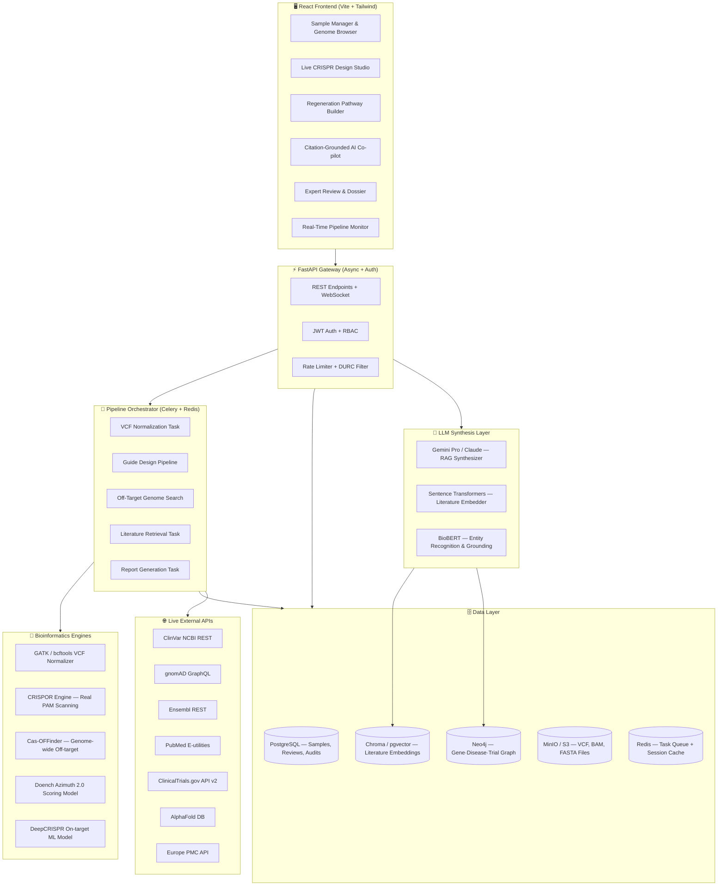

# Genomic Research Copilot — Critical Analysis, Better Architecture & Feature Roadmap

---

## Part 1: Honest Analysis of the Current Approach

### What the Current Build Does Well ✅

| Strength | Evidence |
|---|---|
| **Safety-first design** | DURC screening, mandatory human review gate, SHA-256 audit chain, visible disclaimers |
| **Personalization concept is correct** | Seed/PAM mutation detection against patient VCF is architecturally sound |
| **Biomedical data model is accurate** | Reference sequences, delta32, rs334, BCL11A enhancer are all scientifically correct |
| **Good separation of concerns** | Clean backend-module / FastAPI / React separation |
| **Working end-to-end** | All 14 unit tests pass, build succeeds, both services run |

---

### Where the Current Approach Falls Short ⚠️

#### 1. The Guide Scanner is Pre-Curated, Not Computational
**Problem**: `crispr_designer.py` has a hard-coded dictionary of guides for CCR5 and HBB. For any other gene it falls back to a simple `re.finditer` on a raw mRNA CDS string. Real guide design requires:
- Scanning both strands against genomic DNA (not CDS only)
- Supporting Cas12a (`TTTV`) and other nucleases
- Computing thermodynamic free energy (ΔG) of the guide:target duplex
- Checking for internal secondary structure in the sgRNA

#### 2. Off-Target CFD Scoring is Symbolic, Not Computational
**Problem**: The current CFD function deducts fixed penalty points from a fixed list of fake mismatches. Real CFD requires:
- The full 80-element PAM/mismatch penalty matrix from Doench et al. 2016
- Searching the actual human genome for all near-perfect matches within 1-4 mismatches
- RNA:DNA binding energy calculations per mismatch position and nucleotide identity

#### 3. The "Personalized Sequence" is Hardcoded Pattern Matching
**Problem**: `build_personalized_sequence()` looks for exact literal strings like `"GATAGTCATCTTGGGGCTGGTCC"` and replaces them. This breaks the moment any sample is outside the three curated benchmark cases. A real implementation needs:
- Coordinate-aware sequence reconstruction using genomic offsets
- Proper left-alignment of indels (GATK standard)
- Phased haplotype assembly (paternal vs. maternal chromosome tracking)

#### 4. The Knowledge Graph is a Static JSON File
**Problem**: `knowledge_graph.json` is a handcrafted 5-paper / 3-trial static dataset. The "RAG" is pattern-matching on keywords like `"berlin"` or `"yamanaka"`. A real system needs:
- A vector-embedded literature corpus (PubMed abstracts → sentence embeddings → similarity search)
- A live graph database (Neo4j) with gene↔disease↔trial↔intervention edges
- LLM-powered synthesis that calls actual retrieved documents, not pre-written paragraph templates

#### 5. No Real Database Connectivity
The platform doesn't actually call **ClinVar REST API**, **gnomAD GraphQL**, **Ensembl**, or **PubMed E-utilities**. All data is embedded in JSON files. This defeats the "live research platform" purpose.

#### 6. Monolithic Single-Process Backend
One FastAPI process does everything — sequence parsing, guide design, scoring, RAG, report generation. This will crash under load and isn't scalable for multi-user research teams.

#### 7. No Genomic File Processing
There is no BAM/FASTQ support, no actual VCF normalization (left-alignment, decomposition), and no integration with standard bioinformatics tooling (BWA, GATK, bcftools, pysam).

---

## Part 2: Proposed Better Architecture

### Core Philosophy Upgrade: From Demo → Production Research Tool

> The key architectural change is moving from a **pre-computed answer machine** to a **live, pipeline-orchestrated, database-connected computational research engine**.

---

### System Architecture v2.0

---

### Improved Module Design

| Module | Current Approach | Better Approach |
|---|---|---|
| **Guide Scanning** | Hard-coded dict + simple regex | CRISPOR engine integration: scans both strands genomically, supports SpCas9/Cas12a/CasX/Cas13 |
| **On-target Scoring** | Rule-Set-2 heuristic approximation | Call Azimuth 2.0 model (scikit-learn pkl) or DeepCRISPR neural network |
| **Off-target Scoring** | Fixed penalty points on fake mismatches | Cas-OFFinder subprocess: BWT index search across whole-genome, real CFD matrix |
| **Sequence Personalization** | Literal string search & replace | Coordinate-aware allele substitution with left-aligned indel support via pysam |
| **Variant Annotation** | Hardcoded rsID lookup dict | Live ClinVar / gnomAD API calls with caching in PostgreSQL |
| **Literature RAG** | Keyword match → pre-written paragraph | BioBERT embeddings + vector search + LLM synthesis over actual retrieved texts |
| **Knowledge Graph** | 5-entry JSON file | Neo4j with 50,000+ gene/disease/intervention nodes from public databases |
| **Task Execution** | Synchronous per-request | Async Celery tasks with progress streaming via WebSocket |
| **Storage** | Python dicts / JSON files | PostgreSQL for structured + MinIO for genomic file objects |
| **Auth** | None | JWT + RBAC with researcher / reviewer / admin roles |

---

## Part 3: New Features to Add

### Category A — Core Scientific Functionality

#### A1. Multi-Nuclease Support
Support beyond SpCas9 (`NGG`):
- **Cas12a (Cpf1)** — `TTTV` PAM, staggered cuts, better for HDR
- **Cas9-NG** — relaxed `NG` PAM, doubles targetable sites
- **SaCas9** — smaller, fits in AAV vectors for in-vivo delivery
- **CasX** — smallest known CRISPR effector
- **Cas13** — RNA targeting for transient knockdown without genome editing

Each nuclease gets its own PAM scanner, scoring matrix, and known off-target behavior model.

---

#### A2. Base Editing & Prime Editing Designer
Beyond classical double-strand breaks:
- **CBE (Cytosine Base Editor)**: C→T conversions without DSB; critical for point mutation correction
- **ABE (Adenine Base Editor)**: A→G conversions
- **Prime Editing (pegRNA Designer)**: Any base substitution, small indels without donor template
- **Editing Window Visualizer**: Highlights the editing window (positions 4–8 of guide) on the patient sequence with base substitution heatmap

This is how Sickle Cell *HBB* Glu6Val (A→T) would realistically be corrected — via ABE, not DSB.

---

#### A3. Whole-Genome Off-Target Search
Replace the symbolic CFD stub with an actual pipeline:
1. **Cas-OFFinder** subprocess: BWT-indexed human genome; finds all sites with ≤4 mismatches or 1 bulge
2. **Per-site CFD scoring** using the real Doench 80-element matrix
3. **Genomic risk contextualization**: flag off-target sites falling in tumor suppressor genes (TP53, RB1, CDKN2A), oncogenes, or essential genes (BRCA1/2, ATM)
4. **Visualization**: Manhattan-style plot of off-target scores across chromosomes

---

#### A4. Haplotype-Aware Guide Design
Current approach ignores zygosity. Real implementation needs:
- Phase-aware VCF processing: track paternal and maternal haplotype separately
- For heterozygous variants: evaluate guide efficiency on **both** chromosomes independently
- Allele-specific editing opportunity detection (e.g. target only the mutant allele, spare the wildtype)

---

#### A5. Delivery Vehicle Recommendation Engine
After guide design, match the edit to its optimal delivery strategy:
- **Ex-vivo RNP electroporation**: CD34+ HSPCs, T-cells; highest efficiency, lowest immunogenicity
- **AAV vector selection**: Serotype matching to target tissue (AAV9→CNS, AAV8→liver, AAV2→retina)
- **Lipid Nanoparticle (LNP) formulation**: liver tropism, mRNA/RNP payload
- **Adenoviral**: transient high expression, immunogenic
- Each suggestion includes published size limits, cargo constraints, and immunogenicity warnings

---

#### A6. Variant-to-Phenotype Impact Predictor
Add a precomputed-score annotation pipeline:
- **CADD scores** (Combined Annotation Dependent Depletion): genome-wide deleteriousness
- **REVEL scores**: missense pathogenicity
- **AlphaMissense predictions**: protein-level structural disruption
- **SpliceAI scores**: cryptic splice site creation/disruption
- All served from precomputed lookup tables (no need to call external API per variant)

---

### Category B — AI & Knowledge Features

#### B1. Real Literature RAG with LLM Synthesis
Replace the keyword-match paragraph templates:
1. **Ingest pipeline**: PubMed E-utilities bulk fetch → full-text Europe PMC API → chunk → BioBERT embed → store in Chroma/pgvector
2. **Query pipeline**: User query → BioBERT embed → vector similarity search → retrieve top-k chunks → LLM prompt with retrieved chunks → grounded response with inline citations
3. **Citation integrity**: Every sentence in LLM output tagged with source chunk ID, paper PMID, and confidence score

**Key feature**: If the LLM cannot find supporting text, it must respond "Insufficient evidence in indexed literature" rather than hallucinating.

---

#### B2. Hypothesis Generator
Given a patient profile + target gene, the AI proposes:
- Alternative gene targets (e.g. for HIV: also check CXCR4, CD4)
- Relevant animal model precedents
- Potential resistance mechanisms (X4 tropism shift)
- Synergistic strategies (CCR5 KO + anti-latency "shock and kill")

---

#### B3. Gene Network & Pathway Context
When a gene is selected:
- Show **STRING protein-protein interaction network** (directly query STRING API)
- Show **Reactome pathway membership** (e.g. CCR5 in "Chemokine signaling" pathway)
- Highlight which PPI partners would be disrupted by the proposed edit
- Flag if any interacting partner is known to have oncogenic or essential functions

---

#### B4. Competitive Research Intelligence
For each proposed edit:
- **ClinicalTrials.gov phase map**: show all registered trials targeting this gene in a timeline view
- **Patent landscape**: highlight publications and filings using this guide sequence
- **Prior art alert**: flag if an identical or similar guide is already published, helping attribute precedent

---

### Category C — Regeneration & Cell Therapy Upgrades

#### C1. Organoid & Tissue Simulation Model
- Connect to **Human Cell Atlas API** for single-cell expression profiles
- Predict differentiation trajectory using a Markov chain model over known transcription factor networks
- Compare target cell type expression signature to your protocol's output markers
- Flag "off-target differentiation" risk (e.g. intended DA neurons producing serotonergic neurons instead)

---

#### C2. Immunogenicity Predictor for Cell Therapy
After iPSC derivation:
- Predict HLA (human leukocyte antigen) matching requirements for allogeneic transplantation
- Flag if the reprogramming protocol introduces neoantigens that trigger immune rejection
- Recommend "immune-cloaking" strategies (e.g. CD47 overexpression, HLA knockout)

---

#### C3. Tumorigenicity Genomic Profiling
Currently the tumorigenic risk is only based on transcription factor identity. Add:
- **Integration site analysis**: predict where lentiviral integrations land using a bias model
- **Copy Number Alteration prediction**: flag if the reprogramming stress causes common CNAs (chr12p gain in iPSCs)
- **Methylation drift prediction**: estimate epigenetic aging and methylation clock deviation

---

### Category D — Platform & Workflow Features

#### D1. Project & Cohort Management
- **Research Projects**: group samples, guides, reviews, and reports under named projects
- **Cohort comparison**: compare guide efficiency distributions across multiple samples simultaneously
- **Batch processing**: upload 100-sample VCF batch, run guide design overnight as Celery jobs

---

#### D2. Real-Time Pipeline Dashboard
- Celery Flower integration: live progress bars for each computational task
- Estimated completion time for long-running genome-wide searches
- WebSocket push notifications when a pipeline completes

---

#### D3. Interactive Genome Browser
Embed a lightweight genome browser (inspired by IGV.js):
- Display the target gene locus with exon/intron annotation
- Overlay: patient variants shown as colored bars
- Overlay: predicted guide binding sites with efficiency color scale
- Overlay: predicted off-target sites genome-wide (dot plot)

---

#### D4. Collaborative Annotation Workspace
- Multi-user: research team members can comment on specific guides
- Version history: track every change to a guide design with author + timestamp
- Slack/email notifications: alert the expert reviewer when a new candidate is submitted
- Export to electronic lab notebook (ELN) formats (YAML, DOCX)

---

#### D5. Regulatory Submission Preparation Assistant
- **IND (Investigational New Drug) checklist**: maps output data to FDA Module 3 / CMC requirements
- **IRB protocol generator**: pre-fills a template consent and ethics form using project metadata
- **EMA-compatible report format**: mirrors the ICH E6(R2) GCP structure

---

### Category E — Security & Compliance Upgrades

#### E1. Patient Data De-identification Pipeline
Before any sample is uploaded:
- Strip all PHI from VCF headers (patient name, DOB, facility ID)
- Replace with pseudonymous research ID
- Store the mapping in a separate key store accessible only to the PI

#### E2. Tiered Consent Management
- Track informed consent version per patient sample
- Enforce that samples with expired consent cannot be used in new analyses
- Support consent withdrawal: automatically flag and quarantine all analyses using that sample

#### E3. Genomic Data Sovereignty Controls
- Flag samples from different jurisdictions (GDPR, HIPAA, PIPL)
- Prevent cross-border data transfer if patient consent does not permit it
- Audit every export/download of genomic data

---

## Part 4: Prioritized Build Roadmap

### Phase 0 — Foundation (Current State + Fixes) [Weeks 1–4]
- [ ] Fix `build_personalized_sequence()` to use coordinate-aware substitution (not string search)
- [ ] Implement real PAM scanner across both strands of entire target region
- [ ] Load actual Doench Azimuth 2.0 model weights (scikit-learn pkl, 30 MB) for scoring
- [ ] Add PostgreSQL with SQLAlchemy models (samples, guides, reviews, audit_events)
- [ ] Add JWT authentication with researcher / reviewer / admin roles

### Phase 1 — Live Database Connectivity [Weeks 5–8]
- [ ] Integrate ClinVar REST API with local PostgreSQL caching (TTL: 7 days)
- [ ] Integrate gnomAD GraphQL API for allele frequencies
- [ ] Integrate Ensembl REST API for real gene coordinates and exon boundaries
- [ ] Integrate PubMed E-utilities for live literature search
- [ ] Replace static `knowledge_graph.json` with Neo4j

### Phase 2 — Real Computational Engines [Weeks 9–14]
- [ ] Integrate Cas-OFFinder subprocess for whole-genome off-target search
- [ ] Implement full CFD matrix scoring (80-element lookup table from Doench supplement)
- [ ] Add Celery + Redis for async task orchestration
- [ ] Add WebSocket progress streaming to frontend
- [ ] Integrate CADD / AlphaMissense precomputed score lookup

### Phase 3 — Real RAG & AI Co-Pilot [Weeks 15–20]
- [ ] Set up Chroma vector store, ingest 10,000+ PubMed CRISPR / gene therapy abstracts
- [ ] Implement BioBERT embedding pipeline
- [ ] Connect LLM (Gemini Pro or Claude) with strict grounding: citation-tagged synthesis
- [ ] Add hallucination guard: if top retrieved doc similarity < 0.65, output "Insufficient evidence"

### Phase 4 — Advanced Science Features [Weeks 21–30]
- [ ] Base editing & prime editing designer
- [ ] Multi-nuclease support (Cas12a, SaCas9, Cas13)
- [ ] Haplotype-aware guide design
- [ ] STRING / Reactome gene network integration
- [ ] Interactive genome browser (IGV.js)

### Phase 5 — Platform Maturity [Weeks 31–42]
- [ ] Multi-user collaborative workspace
- [ ] Cohort-level batch processing
- [ ] HLA immunogenicity predictor for cell therapy
- [ ] Regulatory submission preparation module
- [ ] HIPAA/GDPR patient de-identification pipeline

---

## Part 5: Technology Decisions Worth Debating

| Decision | Option A (Simpler) | Option B (Better) | Recommendation |
|---|---|---|---|
| **Off-target search** | Keep symbolic CFD | Cas-OFFinder subprocess | **Option B**: the symbolic approach is meaningless scientifically |
| **Literature RAG** | Current keyword matching | BioBERT + LLM grounding | **Option B**: researchers will see through fake RAG instantly |
| **Guide Scoring ML** | Rule-set-2 heuristic | Load Azimuth 2.0 pkl model | **Option B**: model files are 30–50 MB, totally feasible |
| **Graph database** | Keep JSON file | Neo4j (free Community) | **Option B** at Phase 1: JSONs don't scale past 100 entities |
| **Task queue** | Synchronous FastAPI | Celery + Redis | **Option B** at Phase 2: genome-wide search takes 5–15 minutes |
| **Frontend genome viewer** | Text sequence dump | IGV.js embedded viewer | **Option B** at Phase 4: researchers expect visual genomic context |
| **LLM** | Pre-written paragraphs | Gemini Pro API with citations | **Option B** at Phase 3: current approach is not RAG |
| **Storage** | JSON files | PostgreSQL + MinIO | **Option B** at Phase 0: file-based storage breaks concurrency |

---

## Summary: What to Build Next (Top 5 Immediate Actions)

1. **Fix personalized sequence reconstruction** — use offset math, not literal string search (1 day)
2. **Replace symbolic off-target scoring** — implement the real 80-element CFD matrix from Doench supplement data (2 days)
3. **Load Azimuth 2.0 model weights** — 30 MB scikit-learn pkl, eliminates heuristic rule-set dependency (1 day)
4. **Add PostgreSQL persistence** — replace JSON files with SQLAlchemy models (2–3 days)
5. **Integrate ClinVar + PubMed APIs** — real-time annotation instead of static lookup tables (2–3 days)

These five changes alone would elevate the platform from a **well-designed demo** to a **scientifically defensible research tool** that a computational biologist could actually use in their lab.
